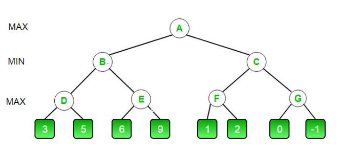
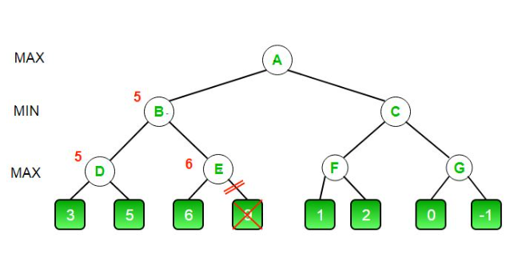
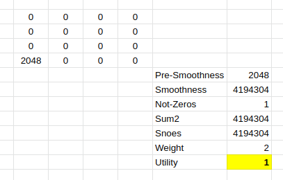
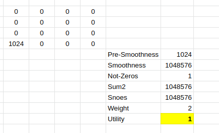
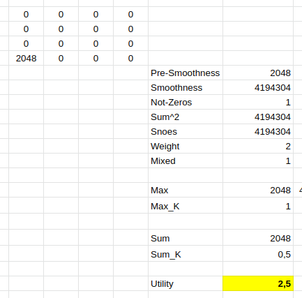
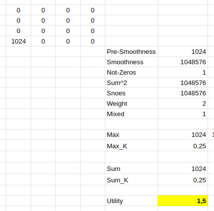
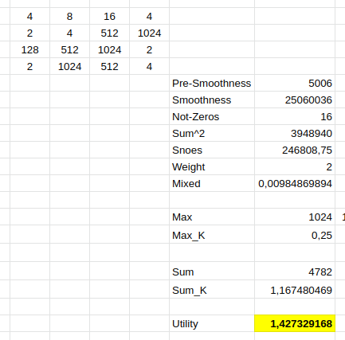
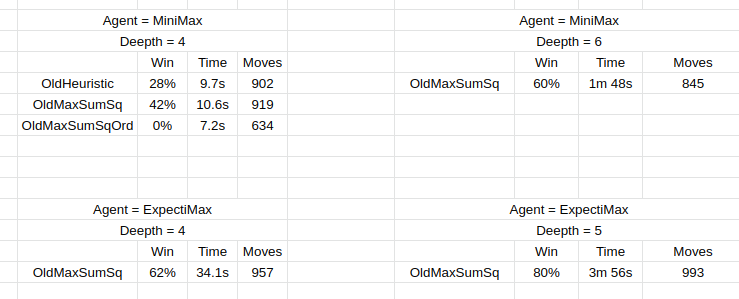

## 2048

Falta la funcion heuristica, comprobar que si gana es mayor a que si pierde
Que sea una funcion rapida
Monocolor, todas crezcan en un sentido
Explicar bien como llegamos a la heuristica

### Abordaje del problema

Este problema decidimos abordarlo mediante la tecnica MiniMax, para asegurarnos garantizar el mínimo resultado posible. 

Para poder abordar el problema de esta forma, debimos analizar el problema como un problema de competencia entre 2 contrincantes, uno somos nosotros, que deseamos maximizar nuestro puntaje, el otro es el juego mismo, que buscará minimizar nuestro puntaje, hacer la jugada que menos nos favorezca, o sea, colocar un dos o un cuatro en el lugar que más nos incomode.

Por lo anteriormente dicho, nosotros seremos Max, mientras que el juego será Min.

Para poder desarrollar el algoritmo, debemos además verificar un par de cosas extra, entre ellas:

1. Saber cuándo finalizar la búsqueda.
1. Saber cómo evaluar si un estado es mejor que el otro.

Para responder la primer pregunta debemos fijarnos en 3 situaciones.

La primera es si llegamos a la profundidad deseada, a medida que buscamos en profundidad los posibles estados se van ramificando. En el caso del jugador tendremos una rama hijo por cada movimiento posible, lo que nos da como mucho 4, no está aquí el problema, el problema está en las posibilidades del juego, ya que para cada lugar disponible tiene la opción de colocar un 2 o un 4, lo que ramifica ampliamente el problema. Para evitar tanto cómputo utilizaremos además la técnica Alpha Beta Prunning, la cual explicaremos luego.

Con respecto a saber evaluar cada estado, lo haremos con la función heurística, la misma fue evolucionando con el problema para buscar la más óptima, dejaremos un log de las mejores encontradas y un resumen de los resultados de las mismas. El algoritmo irá buscando en profundidad las posibles opciones y se quedará con la que la función heurística maximice la utilidad.

### MiniMax

El funcionamiento de la técnica minimax es sencillo de explicar, se basa en que existen dos contrincantes, uno intenta maximizar las utilidades, mientras que el otro busca minimizarlas, lo que lleva a que tengamos que utilizar dos funcines, una para cada uno de ellos. 

De estas funciones se derivará el movimiento que realizará cada uno de ellos.

En pseudocódigo, la función maxi y mini se desarrolla de la siguiente manera:

```py
def function maxi(board):

    if algorithmHasEnded(board):
        return (None, heuristic_utility(board)) # Si el algoritmo finalizó devolvemos la utility que posee el board en el momento.
    
    (max_board, max_utility) = (None, -INF) # Asignamos un board nulo y una utility de menos infinito

    for child in board.children(): # Para cada uno de los posibles movimientos del jugador se abrirá una rama de estudio
        (_, utility) = mini(children) # Le damos el turno al jugador mini para que use la jugada que más nos perjudique y se siga estudiando en profundidad
        if utility > max_utility: # si esa utilidad encontrada es mejor que la que teníamos, la actualizamos y seguimos.
            (max_board, max_utility) = (children, utility)
    return (max_board, max_utility) # retornamos el board que beneficia al jugador

def function mini(board):
    (min_board, min_utility) = (None, +INF)

    if algorithmHasEnded(board):
      return (None, heuristic_utility(board)) # Si el algoritmo finalizó devolvemos la utility que posee el board en el momento.

    for child in board.children(): # Para cada uno de los posibles lugares donde se puede colocar un 2 o un 4 camos a abrir una rama y seguir estudiando en profundidad
      (_, utility) = maxi(board) # Le damos el turno al jugador maxi para que use la jugada que más le beneficie y se siga estudiando en profundidad
      if utility < min_utility:
        (min_board, min_utility) = (child, utility)

    return (min_board, min_utility) # retornamos el board que perjudica al jugador
```

Como podemos ver, son dos funciones que se llaman entre ellas de manera recursiva hasta que llegue a un fin, si no especificamos el nivel de profundidad deseado, continuarán hasta terminar, abriendo incontables cantidades de ramas, por eso se utiliza un parámetro para establecer la profundidad, dicho parámetro se irá reduciendo a medida que nos penetramos en el estudio, frenando el algoritmo al llegar a la profundidad deseada.

Para mejorar el poder de cómputo, utilizaremos además Alpha Beta Prunning, es una poda utilizada en este tipo de algoritmos para no seguir estudiando casos que no modificarán nuestro resultado, permitiéndonos mejorar la profundidad de estudio del algoritmo. Se llama de esta forma porque agrega dos parámetros extra al algoritmo, Alpha y Beta.

- Alpha es el mejor valor que la función maxi puede garantizar.

- Beta es el mejor valor que la función mini puede garantizar.

El pseudocódigo anterior nos queda de la siguiente forma:

```py
def function maxi(board, alpha, beta):

    if algorithmHasEnded(board):
        return (None, heuristic_utility(board)) 
    
    (max_board, max_utility) = (None, -INF) 

    for child in board.children():
        (_, utility) = mini(children, alpha, beta) 
        if utility > max_utility: 
            (max_board, max_utility) = (children, utility)
        if max_utility >= beta:
            break
        if max_utility > alpha:
            alpha = max_score
    return (max_board, max_utility)

def function mini(board, alpha, beta):
    (min_board, min_utility) = (None, +INF)

    if algorithmHasEnded(board):
      return (None, heuristic_utility(board))

    for child in board.children():
      (_, utility) = maxi(board) 
      if utility < min_utility:
        (min_board, min_utility) = (child, utility)
      if min_utility <= alpha:
        break
      if min_utility < beta:
        beta = min_utility

    return (min_board, min_utility)
```

El algoritmo se llama por primera vez con Alpha -INF y Beta + INF.

En la siguiente figura se muestra el ejemplo que vamos a desarrollar:



- En un principio se llama a A con Alpha y Beta con sus valores por defecto, la función maxi seleccionará al mayor entre B y C, comenzaremos con B.
- A B se le aplica la función mini, que seleccionará el mínimo entre D y E, comenzamos con D.
- En D utilizamos la función maxi, y seleccionaremos el máximo entre 3 y 5, comenzará con 3 y se quedará con el máximo entre 3 y -INF, que es 3, como Alpha era -INF, actualizará la misma a 3, para analizar la rama derecha implementará Alpha Beta Prunning.
- D se pregunta si Alpha (3) es mayor a Beta (+INF), lo cual no es verdadero, por lo que sigue analizando la rama derecha.
- D recibe el valor 5, por lo que actualiza Alpha a 5 y retorna 5 a B.
- B estaba utilizando la función mini, por lo que al recibir 5 actualiza a Beta, dejándolo con el mínimo entre 5 y +INF. mini ahora garantiza un valor de 5 o menos. Va a analizar ahora a E para averiguar si da un valor menor a 5.
- E utiliza la función maxi, y hereda los valores de Alpha (-INF) y Beta(5), E seleccionará el mayor resultado posible entre sus hijos.
- E se fija primero en su hijo izquierdo que es 6, y actualiza a Alpha desde -INF a dicho valor. Ahora se fija si le vale la pena buscar en la rama izquierda.
- Como Alpha (6) es mayor que Beta (5), E no precisa fijarse del lado derecho, ya que la función mini garantizó un valor de 5 o menos, E al encontrar un 6 sabe que mini de B no va a seguir por dicha rama, no siendo necesario seguir estudiando.
- B recibe un 6 de D y un 5 de E, por lo que envía un 5 hacia A.
- Por lo que la búsqueda nunca llegó al 9, no siendo computada dicha rama.



### ExpectiMax

Como en este ejercicio conocemos el comportamiento del contrincante, y sabemos con precisión cuál es la distribución de sus jugadas, es que podemos implementar el agente ExpectiMax. 

Sabemos que el juego, en un lugar vacío al azar, nos pondrá un 2 o un 4 con una distribución del 90 y 10 porciento respectivamente, por lo que también implementamos dicho agente, pudiendo de esta forma compararlo con MiniMax y seleccionar el que nos es más conveniente.

La diferencia principal de este agente con el anterior, es que no podemos realizar poda en el mismo, lo que conlleva a que los tiempos se incrementen notoriamente. Como consecuencia de lo anterior, los tiempos se vieron aumentados un 500%, y para poder trabajar con ellos decidimos hacer una especie de poda parcial. Si el algoritmo llegaba a una profundidad en la que sólo le falten 2 niveles, y además, si en ese momento tenemos más de 6 lugares libres en los que se puedan poner un número, entonces cortaremos el análisis y retornaremos el valor actual del tablero. 

```py
if len(emptyCells) >= 6 and d <= 2:
    return (None, self.heuristic_utility(board))
```

De esta forma logramos reducir a 1/5 los tiempos.

### Hiperparámetros

En el proyecto tenemos dos hiperparámetros base para comenzar a analizar, la profundidad y la función heurística.

#### La profundidad

Una vez conseguido un algoritmo que funcionaba (lo habíamos implementado con una profundidad de 5), decidimos con la misma función heurística cambiar la profundidad y registrar los valores obtenidos en cuanto a tiempo y cantidad de ganadas.

Obtuvimos la siguiente tabla:

| Profundidad | Ganadas de 10 | Tiempo Promedio | Tiempo Mínimo | Tiempo Máximo |
|-------------|---------|-----------------|---------------|---------------|
| 3 | 4 | 0:00:24 | 0:00:16 | 0:00:29 |
| 4 | 5 | 0:01:41 | 0:01:15 | 0:02:22 |
| 5 | 8 | 0:07:22 | 0:05:46 | 0:11:08 |

Como podemos ver, a medida que aumentamos la profundidad, el tiempo de procesamiento aumenta de forma exponencial y disminuye la efectividad del algoritmo.

Nos quedaremos con una profundidad de 5 que nos brinda una buena efectividad a costo de un tiempo de procesamiento acorde.

#### La función heurística

La función heurística es la que nos establece qué estado es mejor que otro. En un principio comenzamos con una función simple, basada en la suma del puntaje de los lugares, dividido entre la cantidad de espacios ocupados, de esta forma beneficiábamos que hubiera un gran puntaje y la mayor cantidad de espacios libres.

Obtuvimos un resultado rasonable, probamos agregar el smoothness, y se nos complicó en cuanto a la implementación del algoritmo, nos fuimos dando cuenta de errores que teníamos en el código. Una vez solucionados pudimos implementarla de forma correcta, y obtuvimos un peor resultado que la anterior.

Buscamos entonces mezclarlas y variando sus parámetros, entonces conseguimos una función mixta, que fue la que nos brindó la mayor efectividad, y fue con la que hicimos las pruebas de profundidad documentadas anteriormente.

Luego de poseer la función fuimos probando distintas funciones con una profundidad de 4, que nos permitía correrlas en un tiempo razonable como para ir probando.

Obtuvimos los siguientes resultados:

| Variante | Ganadas de 10 |
|----------|---------------|
| Mixta | 7 |
| Favorecer Smooth | 0 |
| Suma**2 / lugares vacíos | 0 | 
| Mixta + Valor por posición | 1 |
| Sólo favorecer posición | 0 |

Como resultado obtuvimos que tanto el smoothnes como la suma de valores en conjunto nos brindan los mejores parámetros de rendimiento.

En ese momento pensamos que habíamos logrado una función estable y consistente, pero al momento de calcular un valor ganador y otro perdedor, nos llevamos una sorpresa. Si bien mantenía una relación de que un valor ganador era mejor que uno perdedor, todos los valores se mantenían entre 0 y 1, y terminaba siendo 1 siempre que hubiera un sólo número en el tablero, lo que era un error. Mantenía relación con el smoothness pero no era una buena función.




Verificamos de esta forma que podíamos mejorarla si agregábamos el máximo valor a la función. Para favorecer que siempre se intente tener un nuevo máximo sobre otras cosas, utilizamos el máximo valor al cuadrado, y para que el número se mantuviera entre 0 y 1 (para que sea compatible con la función que veníamos implementando), lo dividimos entre el cuadrado de 2048 que es el máximo que se podía alcanzar.

Luego vimos que la suma de todos los números era un valor que debía ser tomado con mayor relevancia, por lo que agregamos el factor de la suma, pero la dividimos entre 4096 (fuimos llegando a dicho valor con múltiples pruebas), de esta forma el factor nos quedó con un número que muy pocas veces superaba el 1.

##### Caso Ganador



##### Caso Intermedio



##### Caso Perdedor



Finalmente, probamos dos funciones más que no tuvieron buenos resultados, una era contemplar que se tuviera un órden creciente en algún sentido, y la otra que se valoraran los números según su posición, dejando los de más valor abajo a la derecha e ir subiendo de valor de forma de serpiente (extagimos dicha función de jugar el juego). Probamos varias veces ambos algoritmos con dichas funciones, pero no lograron resultados positivos notables, ni siquiera agregándolos como factor de la función que venía funcionando.

Tanto para analizar los casos que funcionaron como los que no, tuvimos que probar con valores, verificar nuestras intenciones en el excel, debuguear el código y randerizarlo para ver cómo se comportaba la máquina. Vimos por ejemplo, que algunos casos variaba dependiendo de si estábamos probando con expectimax o con minimax, muchas veces no iba hacia cierto lugar porque seguramente dentro de las peores posibilidades no se obtenían los resultados. O vimos también que si bien programamos las funciones pensando en lo que realizamos cuando jugamos en persona, al llevarlo a código, y la máquina no salirse del guión (como sí lo hacemos nosotros), la técnica no era favorable.

Al final la función heurística nos quedó toda junta en una sóla función a efecto de ahorrar cómputo, quedó de la siguiente manera:

```py
def max_sq_coef_sum(self, board: GameBoard, weight: int):
  count = 0 # cantidad de lugares ocupados
  sum_sq = 0 # la suma de los números al cuadrado
  sum = 0 # la suma de los números
  max = 0 # el número más elevado
  smoothness = 0
  for i in range(4):
    for j in range(4):
      if i < 3:
        smoothness += abs(board.grid[i][j] - board.grid[i + 1][j])
      if j < 3:
        smoothness += abs(board.grid[i][j] - board.grid[i][j + 1])
      sum_sq += board.grid[i][j] ** 2
      sum += board.grid[i][j]
      if board.grid[i][j] ** 2 > max:
        max = board.grid[i][j] ** 2
      if board.grid[i][j] != 0:
        count += 1
  snoes = int(sum_sq/count) # relación entre la suma de los números y los lugares ocupados 
  # favorece que sean números grandes y muchos lugares libres, cuanto más grande mejor
  smoothness = smoothness ** weight # el smoothnes elevado al cuadrado, usamos un weight = 2
  # favorece que los números similares permanezcan juntos, cuanto más grande es peor
  return (snoes / smoothness) + (max / (2048**2)) + (sum / 4096)
  # nos sirvió relacionar en una división el snoes y smoothness
  # se suma además el número más elevado, relacionado con 2048 al cuadrado
  # también se contempla la suma de los números dividido entre 4096
```

### Análisis de los agentes

Durante el transcurso del obligatorio pudimos darnos cuenta de que no teníamos un agente estable, ante las mismas circunstancias, se corrían 10 veces para probar su funcionamiento y podía resultar en que ganaba 8, como podía resultar que ganaba 3, por lo que nos decidimos por realizar varios niveles para ponerlos a prueba.

En un primer nivel, corridas de 50 repeticiones con una profundidad de 4, que son corridas rápidas, y documentar el log en un archivo. Con este nivel probamos las funciones heurísticas.

Una vez tenida la función heurística, pasamos a un segundo nivel, corriendo los dos agentes con una profundidad de 4, pero 50 veces. En este caso decidimos si utilizar MiniMax o ExpectiMax.

Finalmente pasamos a un tercer nivel con 20 corridas y una profundidad de 5 para ExpectiMax o 6 para MiniMax, donde verificamos el rendimiento con corridas más prolongadas.

Los resultados son los siguientes:



En la imágen, se puede ver en el cuadrante superior el comportamiento de las heurísticas, la nomenclatura es la siguiente:

- OldHeuristic es la primer función heurística a la que llegamos, que relaciona el snoes / smoothness
- OldMaxSumSq es la última función que empleamos, la que se explicó en la sección anterior.
- OldMaxSumSqOrd es la que implementamos agregando peso al órden de las filas y columnas, esta no tuvo resultado y no se ve en el código.

Del lado derecho vemos como mejora la función al aumentar la profundidad de estudio. El objetivo que tuvimos era mantenerlo por debajo de los 5 minutos, por lo que llegamos a una profundidad de 5 para ExpectiMax y 6 para MiniMax.

Finalmente, podemos ver que para el ejercicio planteado, ExpectiMax es mejor agente que MiniMax. Esto se debe a que muchas veces por no caer en el peor caso no toma opciones válidas para ir hacia la victoria, y además que al conocer específicamente cómo funciona el algoritmo del juego, podemos utilizarlo a nuestro favor, mejorando de esta forma nuestas ganancias.

El ejercicio lo dejamos pronto para correr con el agente ExpectiMax y una profundidad de 5, que fue la que dió mejores resultados y se mantuvo dentro de un tiempo razonable.

### Referencias

El código implementado y el análsis teórico fue desarrollado en base a lo dado en clase y a varios artículos encontrados en internet, los más relevantes son los siguientes:

https://towardsdatascience.com/playing-2048-with-minimax-algorithm-1-d214b136bffb
https://towardsdatascience.com/how-to-represent-the-game-state-of-2048-a1518c9775eb
https://towardsdatascience.com/how-to-control-the-game-board-of-2048-ec2793db3fa9

https://www.geeksforgeeks.org/minimax-algorithm-in-game-theory-set-4-alpha-beta-pruning/